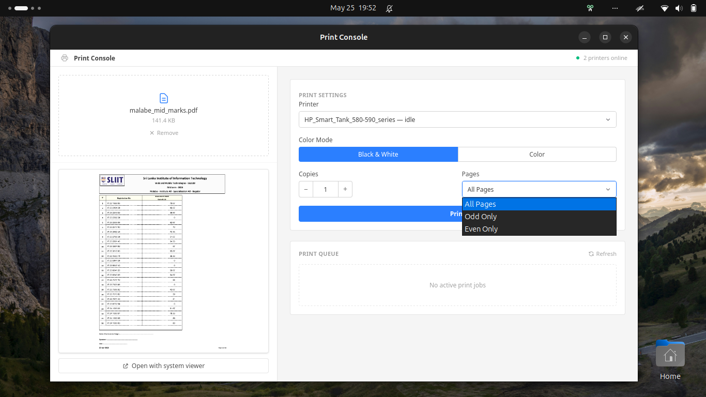

## Print Console

A desktop app I built to manage my printer: 
upload PDFs, preview pages, configure print settings (B&W/color, copies, odd/even pages), and monitor the print queue in real time. Built on top of the CUPS printing layer using `lp` and `lpstat`.




> CUPS is the native printing system on Linux and macOS. Does not work on Windows.

> Requires Rust, Node.js, pnpm, and CUPS (`cups` / `cups-daemon` package) installed on your system.

## Tech Stack

- **Frontend** — React + Vite + Tailwind CSS
- **Backend** — Rust
- **Printing** — CUPS (`lp`, `lpstat`, `pdftoppm`)

## How to Run

```bash
# Install dependencies
pnpm install

# Start in development mode
pnpm tauri dev

# Build for production
pnpm tauri build
```
